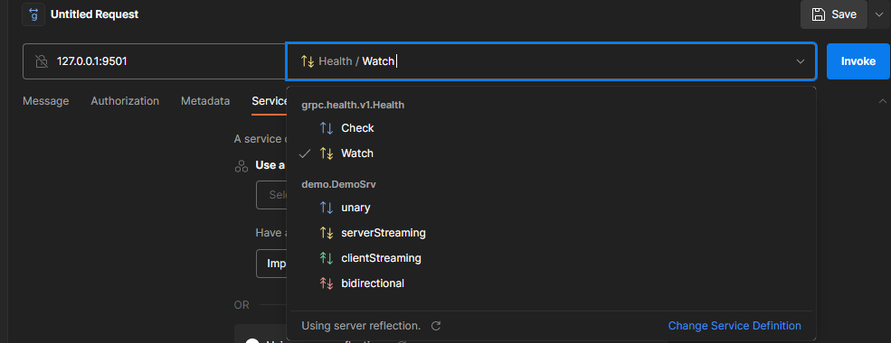

# Grpc 全模式演示项目

使用 Hyperf 实现GRPC服务，并支持 GRPC 全部姿势（unary、服务端流模式、客户端流模式、双向流模式）
核心插件请移步 https://github.com/crayxn/hyperf-grpc/tree/2.0-alpha

## Quick Start

### 环境
PHP >=8;Swoole
（若无环境，可参考 https://learnku.com/articles/77653 搭建）

### 运行
```
git clone git@github.com:crayxn/grpc-stream-demo.git
cd grpc-stream-demo
composer install
php bin/hyperf.php start
```

### 测试
打开 Postman，New > GRPC > Using server reflection



如果对您有帮助，请给个星。谢谢